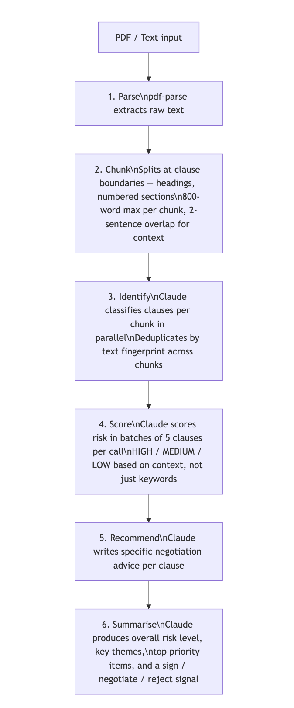

# Leveld  Contract Risk API

NestJS backend built with Domain-Driven Design (DDD) that runs a multi-step AI pipeline to extract, score, and explain risk clauses from contract documents. Accepts a PDF or raw text, streams real-time progress over SSE, and returns structured risk data.

Currently powered by **Anthropic Claude**, with the AI layer built behind a provider interface so swapping to another model requires minimal changes.


## Prerequisites

- **Node.js** 18 or later
- **npm** 9 or later

Get an **Anthropic API key** at [console.anthropic.com](https://console.anthropic.com).

---

## Quick Start

```bash
# 1. Install dependencies
npm install

# 2. Create your env file
cp .env.example .env

# 3. Add your API key to .env
#    ANTHROPIC_API_KEY=sk-ant-...

# 4. Start the dev server (hot reload)
npm run start:dev
```

The API is now running at **http://localhost:3001**.

---

## Environment Variables

All variables are documented in `.env.example`.

---

## API Endpoints

Swagger UI is available at **http://localhost:3001/api** once the server is running.


## Project Structure

```
src/
├── main.ts                          # Bootstrap — loads .env, starts NestJS
├── app.module.ts                    # Root module
│
├── domain/contract/                 # Pure business logic — no framework deps
│   ├── entities/
│   │   ├── contract-analysis.entity.ts
│   │   └── risk-clause.entity.ts
│   ├── value-objects/
│   │   ├── clause-type.vo.ts        # Enum of clause categories
│   │   └── risk-severity.vo.ts      # HIGH / MEDIUM / LOW + scoring helpers
│   └── ports/
│       └── analysis-repository.port.ts   # Storage interface (abstract class)
│
├── application/                     # Orchestrates domain + infra
│   ├── use-cases/
│   │   └── analyze-contract.use-case.ts  # Submits jobs, exposes SSE streams
│   └── dto/
│       └── analyze-contract.dto.ts
│
├── infrastructure/
│   ├── ai/
│   │   ├── ai-client.port.ts        # Abstract AI client (DI token)
│   │   ├── ai-client.factory.ts     # Reads AI_PROVIDER env, returns right client
│   │   ├── anthropic.client.ts      # Anthropic implementation
│   │   ├── json-parser.util.ts      # Shared JSON repair + parse
│   │   ├── batch.util.ts            # Array chunking helper
│   │   ├── prompts/
│   │   │   └── index.ts             # All system + user prompts
│   │   └── pipeline/
│   │       ├── contract-analysis.pipeline.ts   # Orchestrates all 6 steps
│   │       ├── contract-analysis.pipeline.spec.ts
│   │       └── steps/
│   │           ├── chunking.step.ts             # Step 1 — split text
│   │           ├── chunking.step.spec.ts
│   │           ├── clause-identification.step.ts # Step 2 — classify clauses
│   │           ├── risk-scoring.step.ts          # Step 3 — score severity
│   │           ├── recommendation.step.ts        # Step 4 — generate advice
│   │           └── summary.step.ts               # Step 5 — executive summary
│   ├── pdf/
│   │   └── pdf-parser.adapter.ts    # Extracts text from uploaded PDFs
│   └── persistence/
│       └── in-memory-analysis.repository.ts  # In-memory Map store
│
└── interfaces/http/
    ├── contract.controller.ts       # POST /analyze, GET /stream, GET /:id
    └── contract.module.ts           # Wires all providers together
```

---

## The AI Pipeline

A single mega-prompt produces generic output. The pipeline decomposes analysis into 6 discrete, testable steps:



Progress events are emitted on a RxJS `Subject` after each step and streamed to the client via SSE.


## Scripts

```bash
# Dev server with hot reload
npm run start:dev

# Compile TypeScript to dist/
npm run build

# Run compiled build
npm start

# Run Jest unit tests
npm test

# Tests with coverage report
npm run test:cov

# ESLint check
npm run lint
```


## Running Tests

```bash
npm test
```


## Swapping the AI Model

The AI client sits behind `AiClientPort` (`src/infrastructure/ai/ai-client.port.ts`), an abstract class used as the NestJS DI token. The pipeline steps never import a concrete client — they only depend on that interface.

To plug in a different model or provider:

1. Create `src/infrastructure/ai/your-provider.client.ts` extending `AiClientPort`
2. Implement `complete(systemPrompt, userPrompt): Promise<string>`
3. Implement `parseJsonResponse<T>(raw): T` (or reuse `json-parser.util.ts`)
4. Register it in `ai-client.factory.ts` and wire it up in `contract.module.ts`

Nothing else in the codebase needs to change.


## Architecture Notes

**Domain-Driven Design** : the `domain/` layer has zero framework imports. It defines what the system is. The `application/` layer defines what the system does. The `infrastructure/` layer defines how it does it.

**Ports & Adapters** : storage and AI are behind abstract classes (`AnalysisRepositoryPort`, `AiClientPort`). Swap implementations by changing the factory — nothing else changes.

**In-memory store** : analyses are stored in a `Map`. This is intentional for simplicity. For production, implement `AnalysisRepositoryPort` against Redis or Postgres and swap it in `contract.module.ts`.
